# 🧭 מסלול — Maslul AI · MVP

**AI שמוביל את המשתמש ממטרה ← תוכנית ← ביצוע ← תוצאה.**
לא עוד צ׳אט שעונה על שאלות: המשתמש כותב מטרה, והמערכת בונה תוכנית, מפרקת למשימות, זוכרת את הפרויקט, חוקרת, כותבת, ומבצעת פעולות — ולפני כל פעולה שיוצאת לעולם האמיתי היא עוצרת ומבקשת אישור.

## שבעת המודולים

| מודול | מה הוא עושה ב-MVP | איפה בקוד |
|---|---|---|
| 🧠 Brain | זיכרון פרויקט: המטרה, ההקשר ועובדות שהמשתמש סיפר. נשלח לסוכן בכל שיחה. אפשר לערוך ולמחוק. | `components/pilot/store.js`, לשונית "זיכרון" |
| 🔎 Research | מחקר נושא → סיכום Markdown (פעולה פנימית, רצה מיד) | `lib/pilot/ai.js` → `runInternalAction` |
| 📋 Planner | תוכנית עם אבני דרך ומשימות, מתוך מטרה + הקשר + משך | `lib/pilot/ai.js` → `generatePlan` |
| 🤖 Agents | סוכן אחד עם 5 פעולות מוגדרות בלבד | `lib/pilot/policy.js` → `ACTIONS` |
| 🎨 Creator | כתיבת תוכן (פוסטים, מסמכים, טיוטות) | `lib/pilot/ai.js` → `runInternalAction` |
| 📊 Monitor | אחוז התקדמות, התקדמות לפי אבן דרך, יומן פעילות | לשונית "התקדמות" |
| 🔐 Approval | כל פעולה חיצונית ממתינה לאישור, ניתנת לעריכה, והשרת חוסם ביצוע בלי אישור | `lib/pilot/policy.js` → `checkExecutable`, `app/api/pilot/execute` |

## מה נכלל בגרסה 1

1. **הרשמה והתחברות אמיתיות** — שם, אימייל וסיסמה; הפרויקט שמור בחשבון ונפתח מכל מכשיר.
2. **"מה המטרה שלך?"** — מטרה, הקשר, ומשך בשבועות.
3. **צ׳אט AI** — עם כל ההקשר של הפרויקט.
4. **יצירת תוכנית אוטומטית** — 3–5 אבני דרך.
5. **יצירת משימות** — מהתוכנית, מהצ׳אט, או ידנית.
6. **זיכרון של הפרויקט** — נשמר ונשלח בכל שיחה.
7. **Agent אחד עם פעולות מוגבלות** — `research_topic`, `create_content` (פנימיות) · `send_email`, `schedule_event`, `publish_post` (חיצוניות).
8. **אישור לפני פעולה חיצונית** — נאכף גם בממשק וגם בשרת.

### עקרון הבטיחות
- הסוכן **מציע**, המשתמש **מחליט**. הדרישה לאישור נקבעת בשרת מטבלת המדיניות — לא מהמודל ולא מהדפדפן.
- סוג פעולה לא מוכר נחסם תמיד.
- גם אחרי אישור, ב-MVP שום דבר לא נשלח מהשרת: מייל נפתח בתוכנת הדואר של המשתמש (`mailto:`), אירוע יורד כקובץ `.ics`, ופוסט נפתח בחלון השיתוף של הרשת. כך אין צורך לשמור סיסמאות או טוקנים בגרסה הראשונה.
- הזיכרון נשלח למודל כמידע, עם הוראה מפורשת לא לציית ל"הוראות" שמופיעות בתוכו (הגנה בסיסית מ-prompt injection).

## חשבונות ומסד נתונים (שלב 1)

- **אחסון:** Netlify Blobs — עובד אוטומטית באתר ב-Netlify, בלי הגדרות ובלי שירות חיצוני. כל הגישה עוברת דרך `lib/pilot/db.js`, כך שמעבר ל-Postgres/Supabase בעתיד הוא כתיבת backend אחד נוסף.
- **סיסמאות:** scrypt עם salt ייחודי לכל משתמש. הסיסמה עצמה לא נשמרת בשום מקום.
- **Sessions:** טוקן אקראי בעוגייה `httpOnly` + `SameSite=Lax` (+`Secure` בפרודקשן), תוקף 30 יום. בשרת נשמר רק ה-hash שלו.
- **הגנה מניחוש סיסמאות:** עד 10 ניסיונות לכל אימייל ו-30 לכל IP ב-15 דקות. הודעת השגיאה זהה לאימייל קיים ולא קיים.
- **מכסת AI:** עד 150 פעולות AI ליום למשתמש (`MASLUL_AI_DAILY_LIMIT`), כדי שחשבון אחד לא ירוקן את התקציב.
- **יומן ביקורת בשרת:** כל אישור נרשם ע״י `/api/pilot/execute` עם הפרמטרים המדויקים, מי ומתי — לפני שהפעולה מוחזרת. דחיות נרשמות גם הן. אי אפשר לכתוב "אישור" דרך ה-API בעצמך.
- **כל ה-API דורש התחברות.** משתמש רואה רק את הנתונים שלו.
- **מחיקת חשבון** מוחקת את המשתמש, סביבת העבודה ויומן הביקורת, ומנתקת את כל המכשירים.
- מי שהשתמש בגרסה הקודמת (שנשמרה בדפדפן) — הפרויקט שלו מועבר לחשבון אוטומטית בהרשמה.

| מבנה המפתחות | תוכן |
|---|---|
| `users/<id>` | שם, אימייל, hash של הסיסמה |
| `users/by-email/<sha256>` | אינדקס ייחודי לאימייל |
| `sessions/<sha256(token)>` | משתמש + תפוגה |
| `workspaces/<userId>` | פרויקט, תוכנית, משימות, זיכרון, צ׳אט, פעולות |
| `audit/<userId>/<time>_<id>` | רשומת ביקורת |
| `ratelimit/<sha256>` | מונים |

## צילומי מסך

| | |
|---|---|
| 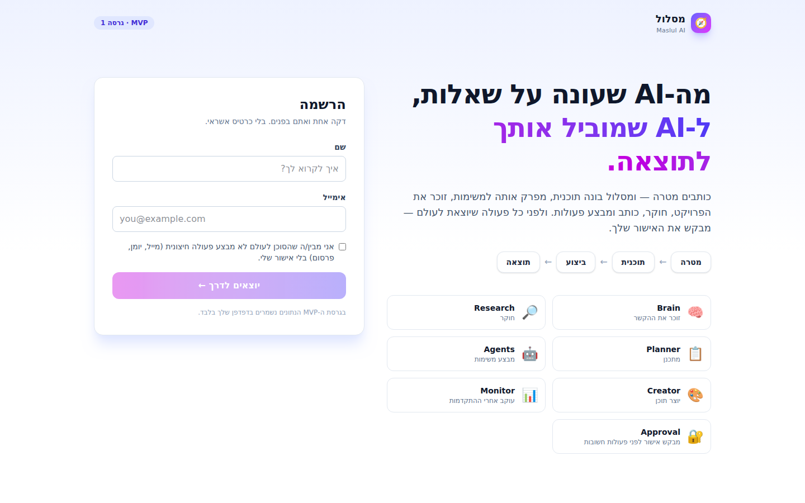 | 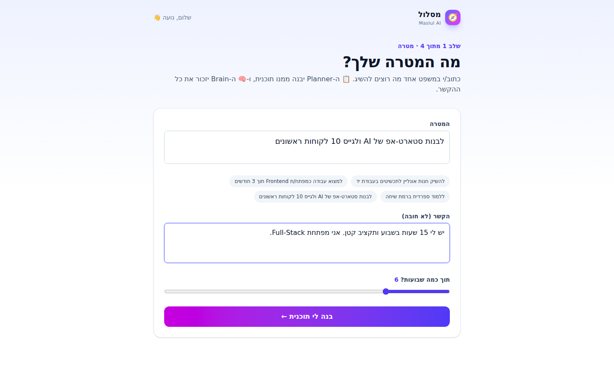 |
| 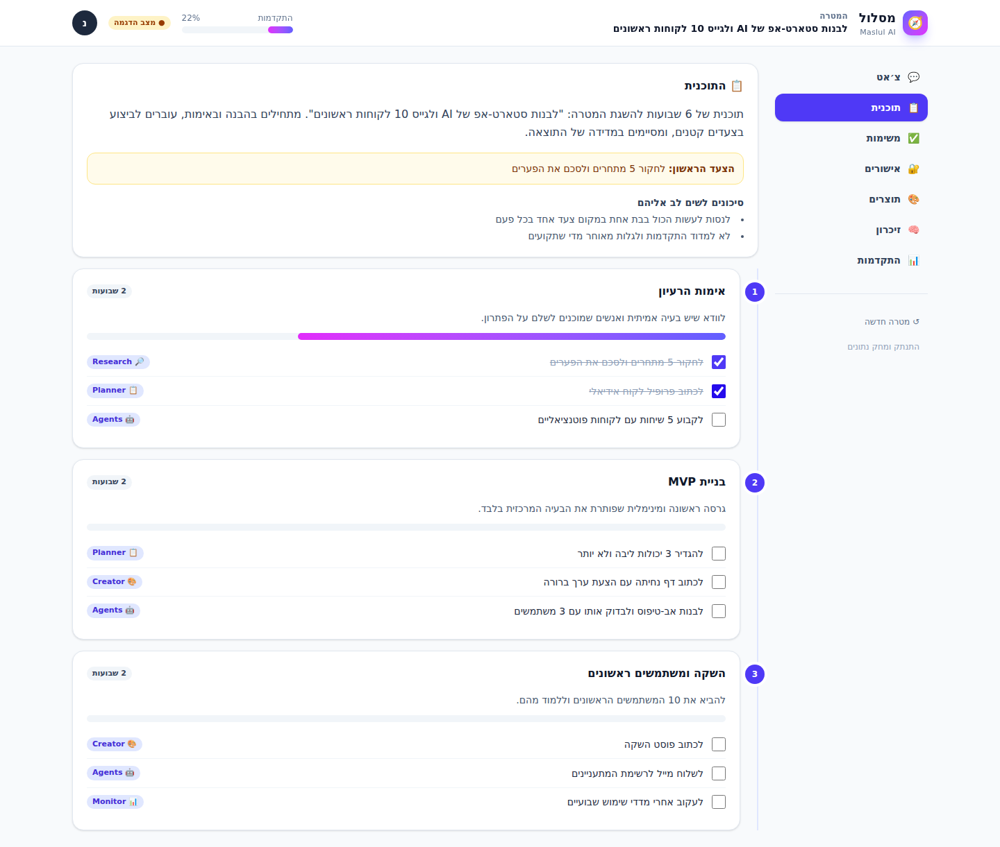 | 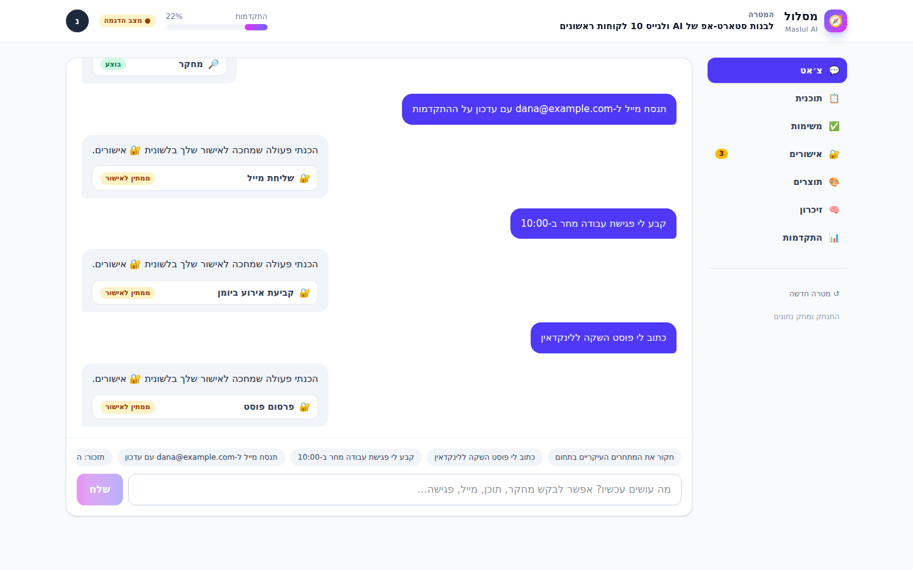 |
| 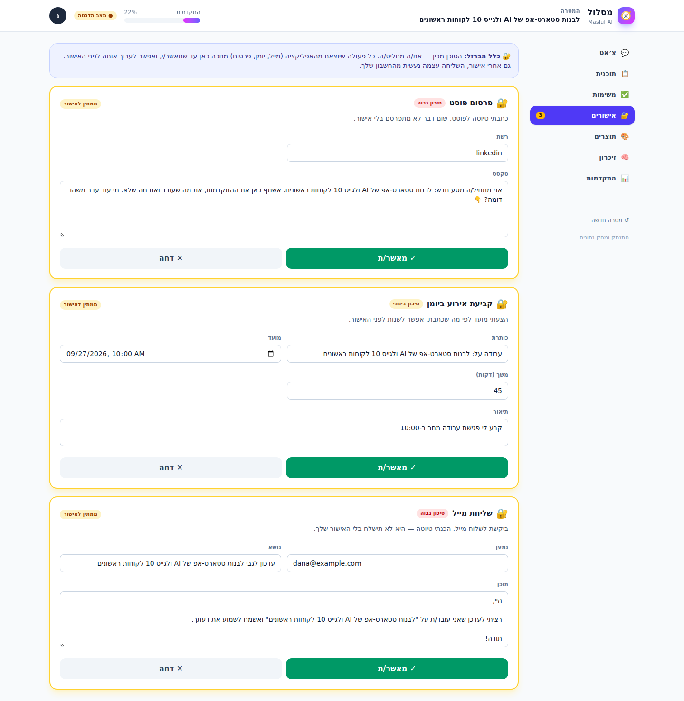 | 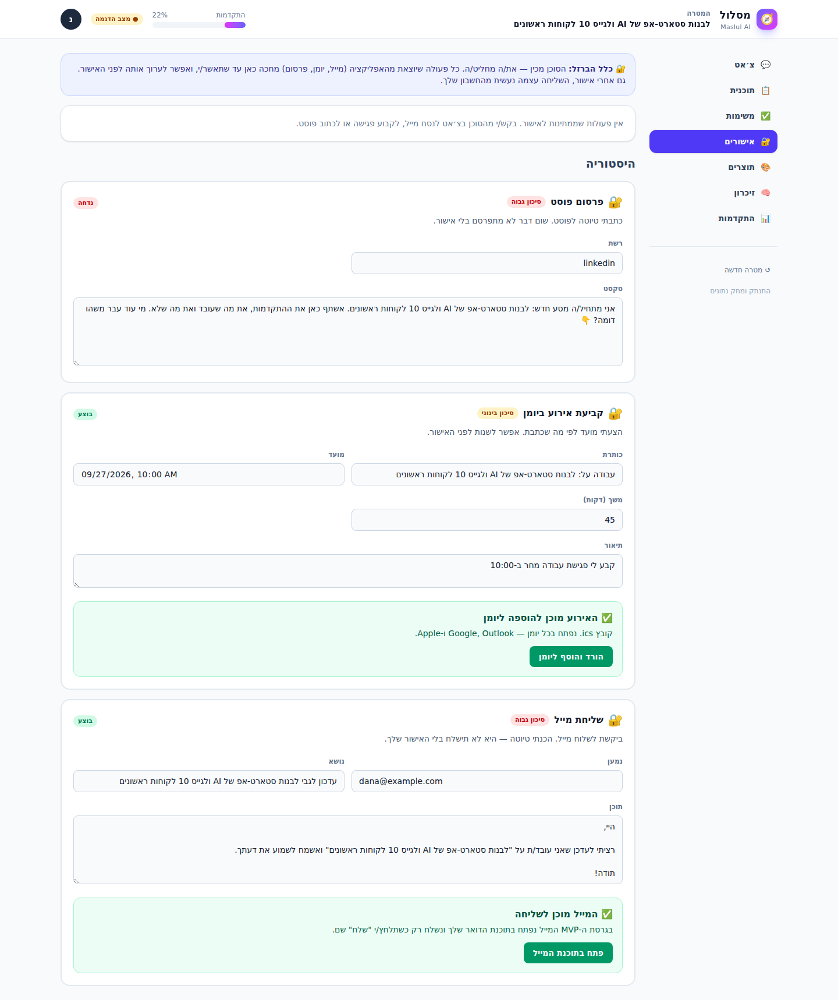 |
| 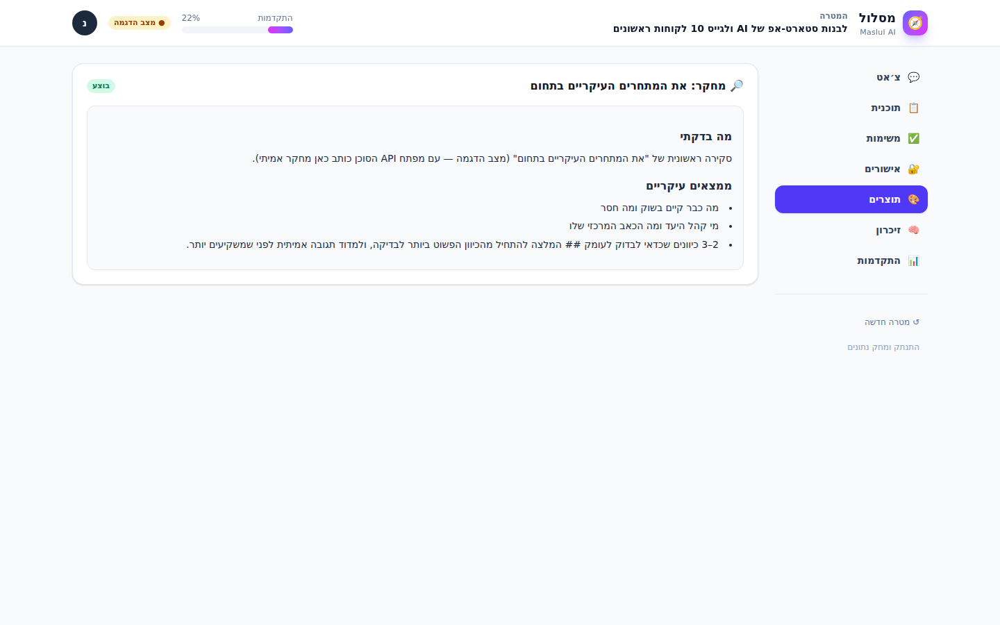 | 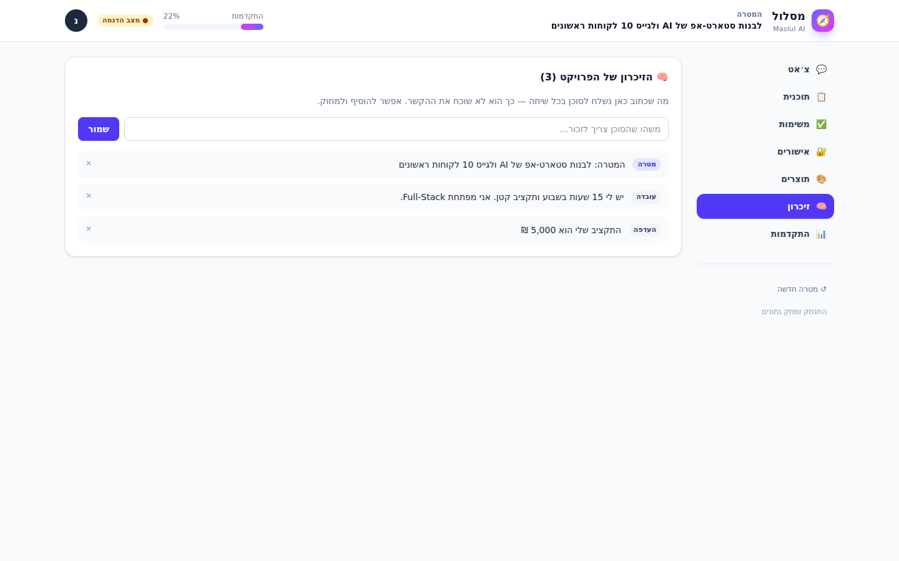 |
| 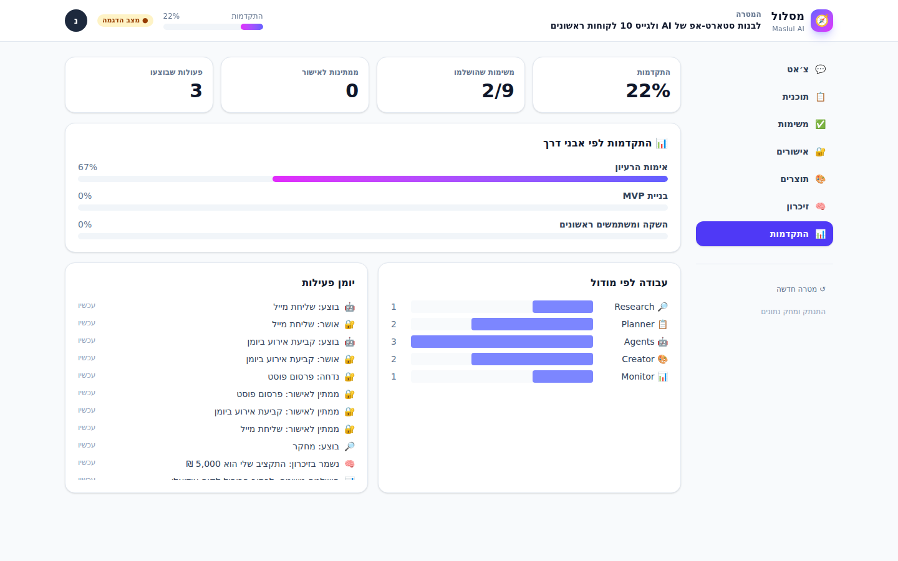 | 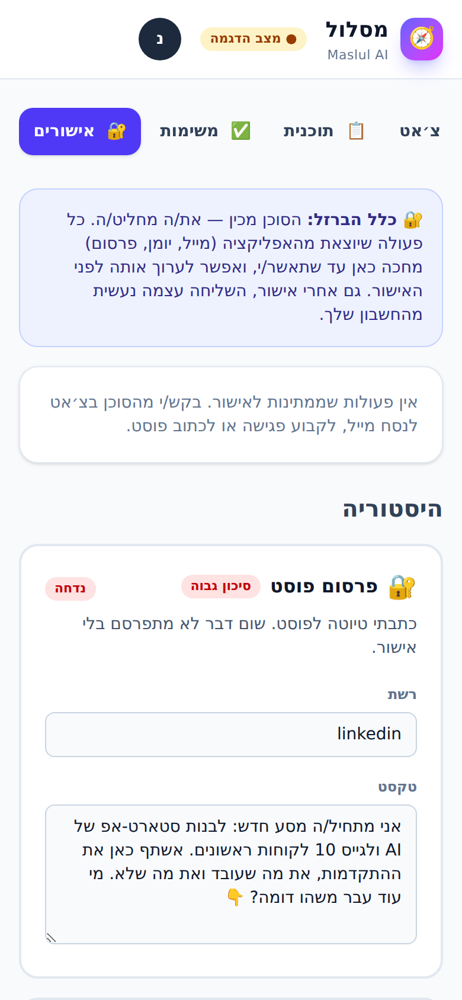 |
| 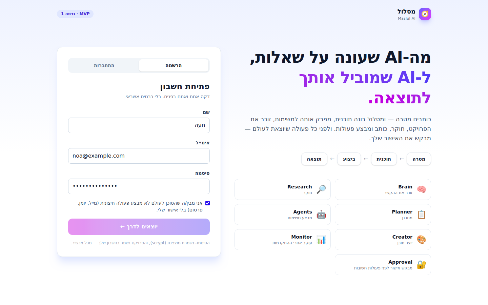 | 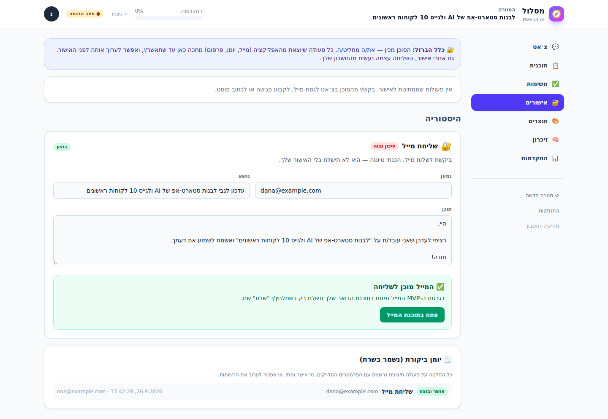 |

## הרצה

```bash
npm install
npm run dev          # http://localhost:3000/pilot  (הנתונים נשמרים ב-.data/)
npm test             # כולל בדיקות המדיניות והאישורים
```

**בלי מפתח API** האפליקציה רצה ב"מצב הדגמה": מנוע חוקים דטרמיניסטי שמדגים את כל הזרימה (תוכנית, משימות, זיכרון, הצעות פעולה, אישורים) בלי עלות.
**עם מפתח** — הוסיפו ל-`.env.local` (או למשתני הסביבה ב-Netlify):

```
ANTHROPIC_API_KEY=sk-ant-...
```

ואז Claude (`claude-opus-5`) מפעיל את התכנון, הצ׳אט, המחקר והכתיבה. התשובות מגיעות בפורמט מובנה (Structured Outputs) כדי שהסוכן יחזיר תמיד משימות/זיכרון/פעולות בצורה שהקוד יכול לבדוק. אם בקשה נחסמת ע״י מדיניות, השרת עובר אוטומטית למודל גיבוי (`fallbacks: "default"`), ואם הקריאה נכשלת לגמרי — חוזרים למצב הדגמה.

## מבנה הקבצים

```
app/pilot/page.jsx            הזרימה: הרשמה → מטרה → סביבת עבודה
app/api/pilot/plan            📋 יצירת תוכנית
app/api/pilot/chat            💬 צ׳אט + זיכרון + הצעות פעולה
app/api/pilot/execute         🔐 ביצוע — חוסם פעולה חיצונית בלי אישור
app/api/pilot/status          האם Claude מחובר או מצב הדגמה
app/api/pilot/auth/*          signup / login / logout / me (+ מחיקת חשבון)
app/api/pilot/workspace       טעינה ושמירה של סביבת העבודה
app/api/pilot/audit           יומן הביקורת
lib/pilot/db.js               אחסון: Netlify Blobs / קבצים / זיכרון
lib/pilot/auth.js             סיסמאות, sessions, rate limit
lib/pilot/workspace.js        סביבת עבודה, ביקורת, מכסת AI
lib/pilot/policy.js           המודולים, הפעולות, ומדיניות האישור
lib/pilot/ai.js               שכבת Claude
lib/pilot/fallback.js         מצב הדגמה
lib/pilot/handoff.js          mailto / ics / share
components/pilot/*            הממשק
lib/pilot.test.mjs            בדיקות המדיניות ומצב ההדגמה
lib/pilot-auth.test.mjs       בדיקות חשבונות, sessions ואחסון
```

## איך מתקדמים מכאן — מפת דרכים

### שלב 0 — עכשיו (שבוע 1)
- [ ] לפרוס ל-Netlify ולהוסיף `ANTHROPIC_API_KEY`.
- [ ] לתת ל-10 אנשים אמיתיים להשתמש. לשאול שאלה אחת: *"הגעת לתוצאה?"*
- [ ] למדוד: כמה השלימו משימה ראשונה, כמה חזרו אחרי 3 ימים, כמה אישרו פעולה.

### שלב 1 — מוצר אמיתי (שבועות 2–4)
- [x] **הרשמה אמיתית ומסד נתונים** — Netlify Blobs + סיסמאות מוצפנות + sessions.
- [x] **יומן ביקורת בשרת** — כל אישור ודחייה.
- [x] **הגבלת שימוש** — rate limit להתחברות + מכסת AI יומית.
- [ ] **אימות אימייל ואיפוס סיסמה** — דורש ספק מיילים (Resend / Postmark).
- [ ] **תזכורות**: מייל יומי "הצעד הבא שלך" (אותו ספק מיילים + Netlify Scheduled Function).
- [ ] **מעבר ל-Postgres** כשצריך שאילתות על פני משתמשים (אנליטיקה, ניהול) — backend נוסף ב-`db.js`.

### שלב 2 — סוכנים עם כוח אמיתי (חודש 2)
- [ ] אינטגרציות OAuth: Gmail (טיוטה ← שליחה אחרי אישור), Google Calendar, LinkedIn.
- [ ] **מחקר עם אינטרנט**: להוסיף את כלי ה-web search של Claude ל-🔎 Research, עם ציטוט מקורות.
- [ ] **רמות אישור**: פעולות בסיכון נמוך אחרי 3 אישורים זהים → "אשר תמיד לסוג הזה" (תמיד ניתן לביטול).
- [ ] סוכנים נפרדים לכל מודול (Research Agent, Creator Agent) עם תזמור מרכזי.

### שלב 3 — צמיחה (חודשים 3–6)
- [ ] תבניות מטרה לפי נישה (עסק קטן, חיפוש עבודה, לימודים) — אפשר להתחיל מאחת ולשלוט בה.
- [ ] מודל עסקי: Free (פרויקט אחד, מצב בסיסי) / Pro ~₪49–79 לחודש (סוכנים ואינטגרציות) / Team.
- [ ] אפליקציית מובייל (PWA) + התראות.
- [ ] פרטיות: מחיקת נתונים בלחיצה, ייצוא, הצפנה, מדיניות פרטיות ותנאי שימוש — לפני גיוס כסף.

### הבידול (לזכור תמיד)
לא מנצחים את ChatGPT ב"AI שיודע יותר". מנצחים במוצר שבו ה-AI הוא **המנוע** — והמשתמש מקבל **תוצאה**, לא תשובה. כל פיצ׳ר חדש צריך לענות על שאלה אחת: *האם הוא מקרב את המשתמש לתוצאה?*
